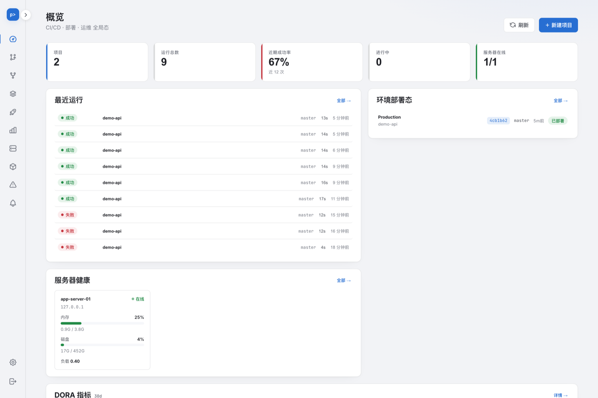
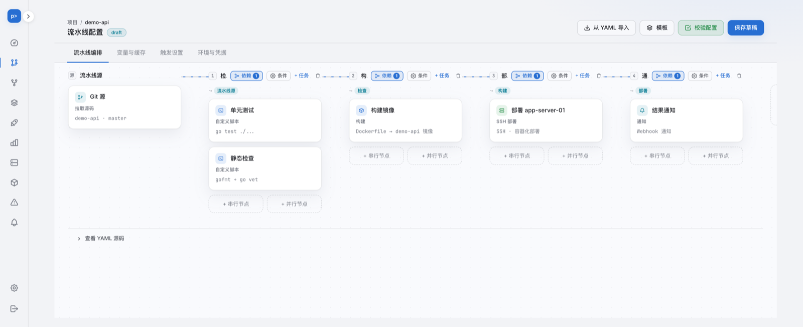
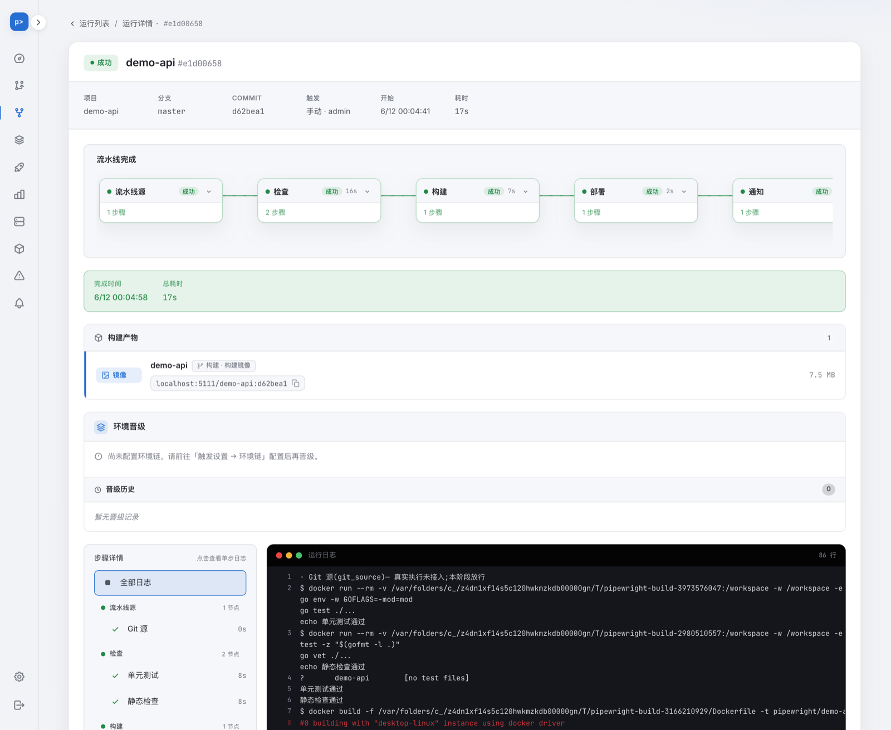
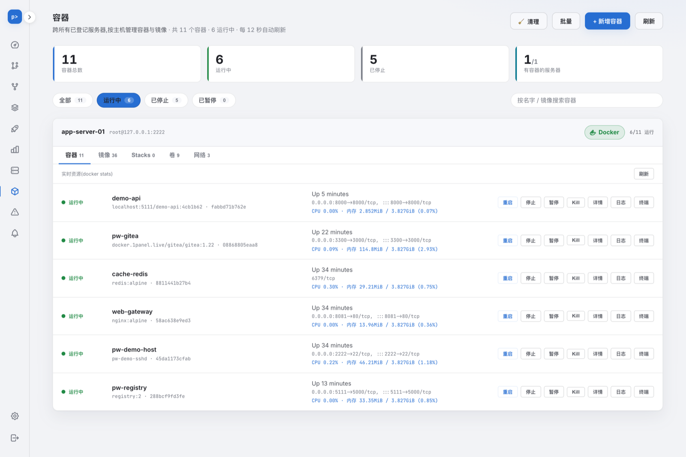

<div align="center">

# Pipewright

**A lightweight, self-hosted CI/CD + deployment + ops platform.**
A single static Go binary (frontend embedded, zero runtime dependencies) —
one tool replacing the "CI + Ansible/Kamal + Portainer" trio.

[](https://github.com/huangchengsir/pipewright/releases)
[](https://github.com/huangchengsir/pipewright/actions/workflows/ci.yml)
[](LICENSE)

English | [简体中文](README.md)

</div>

---

## Why Pipewright

Mainstream options are either heavy (Jenkins with a pile of plugins + JVM) or a three-tool assembly (Woodpecker/Drone + Ansible/Kamal + Portainer). Pipewright packs "continuous integration, multi-server deployment, and server/container ops" into **one static binary**: download, start, open the browser — that's the entire install.

| | Pipewright | Jenkins | Drone + Ansible + Portainer |
|---|:---:|:---:|:---:|
| Single-binary deploy | ✅ | ❌ JVM + plugins | ❌ three-tool assembly |
| Visual pipeline orchestration (DAG) | ✅ built-in canvas | plugin | hand-written YAML |
| Isolated builds | ✅ | ✅ | ✅ |
| Multi-server deploy (SSH, agentless) | ✅ built-in | plugin | Ansible |
| Server / container ops | ✅ built-in | ❌ | Portainer |
| Zero-downtime + failure rollback | ✅ | plugin | DIY |
| One-click self-update | ✅ | ❌ | ❌ |

## Screenshots

**Global overview** — projects, run success rate, environment deployment status, server health, and DORA metrics, all on one screen:



**Visual pipeline orchestration** — a two-level (stage/job) DAG canvas: horizontal links for serial, vertical side-by-side for true parallel. Supports matrix builds, manual approval gates, sidecar services, and post-stage steps; the canvas and YAML round-trip both ways:



**Run detail** — stage transitions, live logs (SSE push + history replay), build artifacts and image references, and per-step status:



**Container management** — one-stop management of containers/images/Stacks/volumes/networks across hosts, with lifecycle operations, live stats, logs, and an interactive terminal:



## Feature Overview

- **🔐 Security foundation** — single-admin auth (argon2id + CSRF) · encrypted credential vault (NaCl secretbox, masked display, never plaintext) · append-only audit · end-to-end secret redaction.
- **🧩 Projects & pipelines** — visual orchestration canvas (stage DAG + intra-stage job-level DAG) · matrix builds · manual approval gates · sidecar services (attach DB/Redis for tests) · trigger rules + branch→environment mapping · server-authoritative validation.
- **🏗 Isolated builds & artifacts** — version-pinned isolated builds inside containers · build dependency caching · multiple artifact types (image/JAR/dist) + push to private registries · live terminal logs (SSE) + history replay · read-only code browsing (Monaco).
- **🚀 Multi-server deployment** — agentless deploy over SSH · health gating · zero-downtime cutover + failure rollback · parallel fan-out across hosts + visible partial failures · environment deployment history and rollback.
- **📣 Notifications** — WeCom / DingTalk / Lark (Feishu) / email / custom webhook · fine-grained event→channel routing · templates + custom variables · in-pipeline notification nodes.
- **🖥 Server & container ops** — multi-host status overview (CPU/memory/disk) · container/image/Stacks/volume/network management · live + historical service logs · interactive container terminal · web ops terminal (host shell, full copy-paste/signal support) · anomaly detection alerts.
- **📈 Metrics** — the four DORA metrics (deployment frequency / lead time for changes / change failure rate / mean time to restore) out of the box.
- **🔄 Update check + one-click self-update** — Settings → System checks GitHub for the latest release with semantic comparison; binary deployments can **auto-update with one click** from the UI (download + checksum verification + atomic replace + self-restart), while Docker deployments get the exact upgrade command.

> Security is non-negotiable: credentials stored as ciphertext only, commands arrayified against injection, outbound SSRF locked down, logs redacted.

## Install / Deploy

Pick any of three form factors. The platform itself is a single static binary with **zero runtime dependencies** (no Go/Node required).

> **Docker prerequisite**: the platform itself doesn't depend on Docker, but **"isolated builds / container deployment" do require Docker** (without it, it degrades to a stub runner and performs no real builds). The console / SSH deployment / notifications don't need Docker. The one-click script **detects Docker** and prompts if it's missing; on Linux you can set `INSTALL_DOCKER=1` to auto-install it (via the official get.docker.com); on macOS, install Docker Desktop.

### ① One-click script (Linux / macOS)

Downloads the static binary for your platform from GitHub Releases and installs it to `/usr/local/bin` (with checksum verification + Docker detection):

```bash
curl -fsSL https://raw.githubusercontent.com/huangchengsir/pipewright/master/install.sh | sh

# Pin a version / custom dir / auto-install Docker on Linux too:
VERSION=v1.0.0 INSTALL_DIR=$HOME/.local/bin INSTALL_DOCKER=1 \
  sh -c "$(curl -fsSL https://raw.githubusercontent.com/huangchengsir/pipewright/master/install.sh)"

# Run (first launch bootstraps the admin; master key is for the credential vault)
PIPEWRIGHT_MASTER_KEY=$(openssl rand -base64 32) \
PIPEWRIGHT_ADMIN_PASSWORD=change-me \
  pipewright          # open http://localhost:8080, log in with admin / change-me
```

**Recommended: install as a systemd service** (auto-start on boot + restart on crash + one-click self-update available; Linux, requires root). The script persists the master key to `/etc/pipewright/master.key`, stores data in `/var/lib/pipewright`, and writes config to `/etc/pipewright/pipewright.env`:

```bash
SETUP_SERVICE=1 sh -c "$(curl -fsSL https://raw.githubusercontent.com/huangchengsir/pipewright/master/install.sh)"
# Status / logs: systemctl status pipewright  ·  journalctl -u pipewright -f
# Change port etc.: edit /etc/pipewright/pipewright.env then systemctl restart pipewright

# Use MySQL instead of the default SQLite (DSN is go-sql-driver format; parseTime=true is required):
SETUP_SERVICE=1 PIPEWRIGHT_DB_DRIVER=mysql \
  PIPEWRIGHT_DB_DSN='user:pw@tcp(host:3306)/pipewright?parseTime=true&charset=utf8mb4' \
  sh -c "$(curl -fsSL https://raw.githubusercontent.com/huangchengsir/pipewright/master/install.sh)"
```

> Windows users: download the `.zip` from [Releases](https://github.com/huangchengsir/pipewright/releases).

### ② docker compose (recommended for self-hosting)

```bash
curl -fsSLO https://raw.githubusercontent.com/huangchengsir/pipewright/master/docker-compose.yml
curl -fsSLO https://raw.githubusercontent.com/huangchengsir/pipewright/master/.env.example
cp .env.example .env       # at minimum set PIPEWRIGHT_ADMIN_PASSWORD, and openssl rand -base64 32 for MASTER_KEY
docker compose up -d       # data persists in the named volume pipewright-data; see .env comments to switch to MySQL
```

### ③ docker run (fastest trial)

```bash
docker run -d -p 8080:8080 -v pipewright-data:/data \
  -e PIPEWRIGHT_ADMIN_PASSWORD=change-me \
  -e PIPEWRIGHT_MASTER_KEY=$(openssl rand -base64 32) \
  ghcr.io/huangchengsir/pipewright:latest
```

### Build from source

```bash
make build          # frontend build → go:embed → single static binary ./pipewright (pure Go, no CGO)
./pipewright --version
```

### Updating

Open **Settings → System** and click "Check for updates" to query the latest release; when a new version is available:

- **Binary deployment**: click "Update now" to auto-download the new version + verify checksum + replace + restart (requires write permission to the binary file; installing to `$HOME/.local/bin` avoids sudo, and a root systemd service installed via `SETUP_SERVICE=1` also satisfies this).
- **Docker deployment**: the container doesn't replace its own image; follow the prompt to run `docker compose pull && docker compose up -d` on the host (the data volume is preserved).

### Configuration (environment variables)

| Variable | Description | Default |
|---|---|---|
| `PIPEWRIGHT_ADDR` | HTTP listen address | `:8080` |
| `PIPEWRIGHT_RELEASE_REPO` | GitHub repo queried for update checks (change it for a fork) | `huangchengsir/pipewright` |
| `PIPEWRIGHT_DB_DRIVER` | Database driver: `sqlite` or `mysql` | `sqlite` |
| `PIPEWRIGHT_DB` | SQLite database path (when driver=sqlite) | `pipewright.db` |
| `PIPEWRIGHT_DB_DSN` | MySQL DSN (required when driver=mysql) | none |
| `PIPEWRIGHT_MASTER_KEY` | Credential vault master key (base64-encoded 32 bytes); or use `_FILE` to point to a file | vault disabled if unset |
| `PIPEWRIGHT_ADMIN_USERNAME` | Admin username on first launch | `admin` |
| `PIPEWRIGHT_ADMIN_PASSWORD` | Admin password on first launch | none (must be set) |
| `PIPEWRIGHT_RUNNER` | Run executor: default DAG (orchestrates stages/script/deploy_ssh/notify per the canvas); set `legacy` to fall back to the old fixed flow | `dag` |

## Pipeline as code (GitOps)

Commit your pipeline structure to `.pipewright.yml` in the repo — **same source of truth as your code, reviewable in a PR, evolving per branch** — instead of relying on implicit drift in the canvas.

- **Enable**: flip the "Pipeline as code" toggle on the project's pipeline page (per project).
- **How it works**: once enabled, every run reads `.pipewright.yml` from the **repo root** on the **branch being built** (falling back to the project default branch when the branch is empty), and the pipeline spec in that file drives the run. Different branches can carry different `.pipewright.yml`. The file is fetched with the project's bound repo credential (ephemeral; no new exposure).
- **Never breaks a run**: if the file is **missing** → falls back to the pipeline configured in the canvas (UI); if it exists but is **invalid YAML** → also falls back to the stored canvas config.
- **Scope**: the YAML controls **pipeline structure only** (stages / jobs / `needs` / DAG layout). **Variables & cache, environments & credentials, and trigger rules** still come from the canvas (UI) settings — they are **not** in the YAML.
- **Schema** is the same one used by the platform's "Import from YAML" (`version` + `stages` → `jobs`; a job uses a nested `script:` block for `image`/`commands`/`env`/`workdir`).

```yaml
version: 1
stages:
  - id: stg_src             # needs references stages by id, so cross-stage deps need an explicit id
    name: Source
    kind: source
    jobs:
      - name: Gitee source
        type: git_source
  - id: stg_build
    name: Build
    kind: build
    needs: [stg_src]
    jobs:
      - name: Run tests
        type: script
        script:
          image: golang:1.23
          commands:
            - go vet ./...
            - go test ./...
          env:
            CGO_ENABLED: "0"
          workdir: src/app
  - id: stg_deploy
    name: Deploy
    kind: deploy
    needs: [stg_build]
    gate: true              # manual approval gate
    when:
      branches: [main, release/*]
    jobs:
      - name: SSH deploy
        type: deploy_ssh
        config:
          targetEnv: prod
```

> You can also force pipeline-as-code on for **all projects** (ignoring the per-project toggle) via the global env var `PIPEWRIGHT_PAC_RUNTIME=1`, for back-compat / power users.

## Tech Stack

- **Backend**: Go · Chi (routing) · modernc/sqlite (pure Go, no CGO) · go-git · NaCl secretbox (vault) · argon2id · golang.org/x/crypto/ssh (agentless deployment)
- **Frontend**: Vue 3 `<script setup>` · Vite · naive-ui · OKLCH dual theme · Monaco (read-only code browsing) · embedded into the binary via `go:embed`

## Architecture

```
single static binary (cmd/pipewright)
├── internal/auth        auth + sessions + CSRF
├── internal/vault       encrypted credential vault (secretbox)
├── internal/audit       append-only audit + redaction
├── internal/project     project onboarding + repo detection
├── internal/pipeline    pipeline spec + build/deploy config + validation
├── internal/trigger     webhook + branch-mapping triggers
├── internal/run         run model + worker pool + logs + artifacts
├── internal/dagrun      DAG scheduling (stage-level + job-level, matrix expansion)
├── internal/build       isolated builds + image/artifacts + dependency caching
├── internal/target      generic SSH exec/session layer (shared by deploy + ops)
├── internal/deploy      SSH deploy execution + health gating + rollback
├── internal/notify      multi-channel notifications + event routing + templates
├── internal/httpapi     the sole outward HTTP surface (domain packages never touch HTTP)
└── web/                 Vue 3 frontend (embedded via go:embed)
```

## Project Status

✅ **Officially released** and under active iteration — see the latest version in [Releases](https://github.com/huangchengsir/pipewright/releases) (tag-driven releases: 6-platform binaries + ghcr multi-arch images). Already running in real production, carrying builds, deployments, and daily ops for multiple projects.

## Contributing

PRs and issues welcome! Before you start, please read [CONTRIBUTING.md](CONTRIBUTING.md) (environment setup / testing / commit conventions) and follow the [Code of Conduct](CODE_OF_CONDUCT.md). For security vulnerabilities, please use the private channel described in [SECURITY.md](SECURITY.md).

## License

MIT — see [LICENSE](LICENSE).

---

<div align="center">
<sub>Pipewright — CI, deployment, and ops in a single binary.</sub>
</div>
