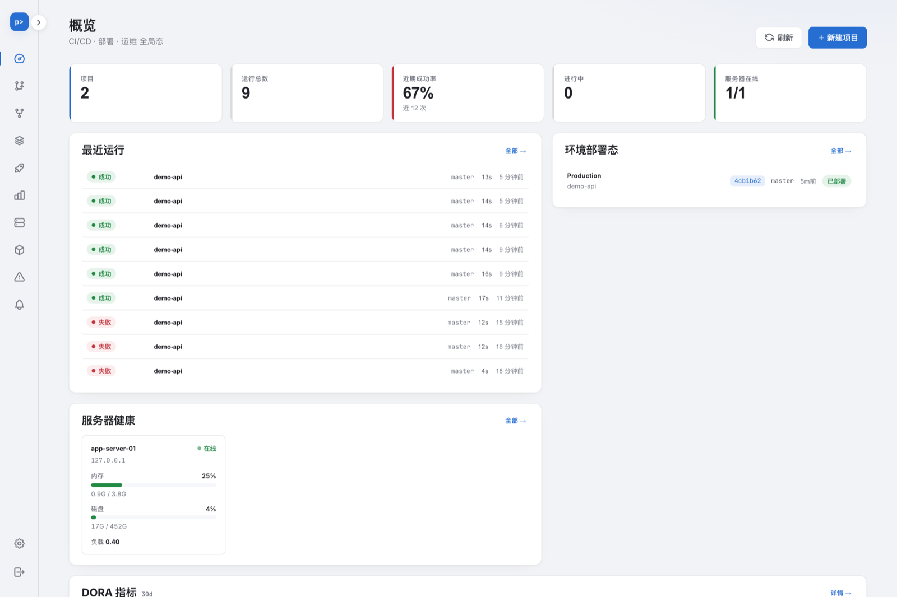
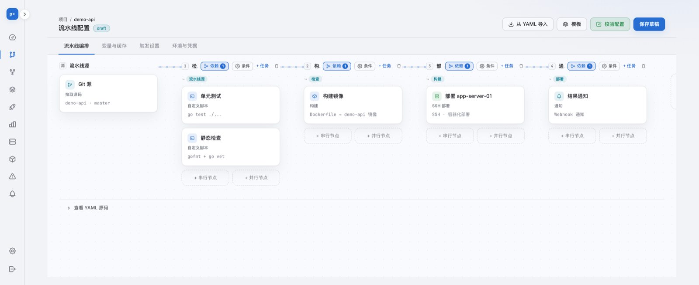
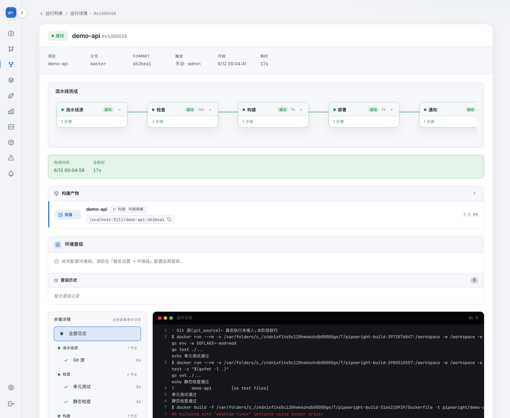
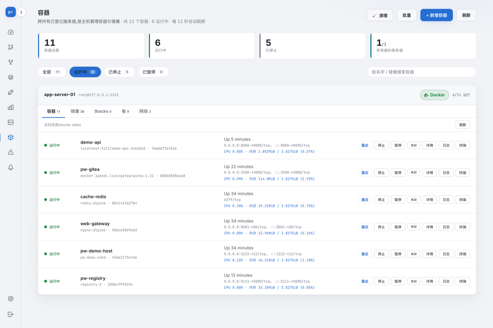

<div align="center">

# Pipewright

**一个轻量、自托管的 CI/CD + 部署 + 运维一体化平台。**
单个 Go 静态二进制(内嵌前端,运行时零依赖),
一个工具替掉「CI + Ansible/Kamal + Portainer」三件套。

[](https://github.com/huangchengsir/pipewright/releases)
[](https://github.com/huangchengsir/pipewright/actions/workflows/ci.yml)
[](LICENSE)

[English](README.md) | 简体中文

</div>

---

## 为什么是 Pipewright

主流方案要么重(Jenkins 一堆插件 + JVM),要么是三个工具拼装(Woodpecker/Drone + Ansible/Kamal + Portainer)。Pipewright 把「持续集成、多服务器部署、服务器/容器运维」装进**一个静态二进制**:下载、启动、打开浏览器,就是全部安装过程。

如今它已长过那三件套:把部署好的服务挂上 HTTPS 域名(原本的 nginx + certbot 那一步)、给每个 PR 一个能点开的预览地址,也都内置了。

| | Pipewright | Jenkins | Drone + Ansible + Portainer |
|---|:---:|:---:|:---:|
| 单二进制部署 | ✅ | ❌ JVM + 插件 | ❌ 三套拼装 |
| 可视化流水线编排(DAG) | ✅ 内置画布 | 插件 | YAML 手写 |
| 流水线即代码(按分支演进) | ✅ | 插件 | ✅ |
| 隔离构建 | ✅ | ✅ | ✅ |
| 多服务器部署(SSH,免 Agent) | ✅ 内置 | 插件 | Ansible |
| 服务器 / 容器运维 | ✅ 内置 | ❌ | Portainer |
| 零停机 + 失败回滚 | ✅ | 插件 | 自己写 |
| 自动 HTTPS + 域名反向代理 | ✅ 内置 | ❌ | ❌ |
| Per-PR 预览环境 | ✅ 内置 | ❌ | ❌ |
| DORA 指标 | ✅ 内置 | 插件 | ❌ |
| AI 失败诊断 | ✅ 可选 | ❌ | ❌ |
| 一键自更新 | ✅ | ❌ | ❌ |

## 界面预览

**全局概览** —— 项目、运行成功率、环境部署态、服务器健康、DORA 指标,一屏全局:



**可视化流水线编排** —— 阶段/任务两级 DAG 画布:横向连线串行、纵向并排真并行,支持矩阵构建、人工审批门、旁挂服务、阶段后置步骤;画布与 YAML 双向往返:



**运行详情** —— 阶段流转、实时日志(SSE 推送 + 历史回放)、构建产物与镜像引用、逐步骤状态:



**容器管理** —— 跨主机容器/镜像/Stacks/卷/网络一站管理,生命周期操作、实时 stats、日志、交互终端:



## 能力总览

- **🔐 安全地基** —— 单管理员认证(argon2id + CSRF)· 凭据加密保险库(NaCl secretbox,掩码呈现,绝无明文)· OAuth 应用接入 Gitee / GitHub / GitLab / 自建实例(拿到的 access token 直接存成可复用的保险库凭据)· append-only 审计(SQLite trigger 硬拦 UPDATE/DELETE)+ 可选远端 sink · 按 run 解析真实凭据后对日志 / 诊断 / 通知全链路脱敏。
- **🧩 项目与流水线** —— 可视化编排画布(阶段 DAG + 阶段内任务级 DAG)· 矩阵构建 · 人工审批门(可直接在通知里点签名链接审批)· 旁挂服务(测试挂 DB/Redis)· 阶段 `when` 条件 + 阶段后置步骤 · 类型化运行参数(枚举/布尔/数字,触发时即校验)· 触发方式:webhook、分支→环境映射、5 字段 cron 定时、上游→下游流水线串联(深度门 + 路径门防环)· 项目级并发上限 + 超限 FIFO 排队 · 复用库:流水线模板 / 变量组 / 自定义节点 · 服务端权威合法性校验。
- **📝 流水线即代码** —— 把流水线结构写进 `.pipewright.yml`、按分支各自演进,画布配置始终作为兜底回退([详见下文](#流水线即代码gitops))。
- **🏗 隔离构建与产物** —— 版本钉死的容器内隔离构建(docker/nerdctl/podman)· 代码管理区:本地 bare 镜像 + 增量 fetch,秒级出工作区 · 构建依赖缓存(按分支 + lockfile hash 寻址)· 内容寻址制品库,jar/dist 存**真字节**供部署(而非占位 reference)· 镜像构建 + 推送私有仓库 + 镜像 GC · 每项目可指定远程构建机(构建经 SSH 下沉到远程,token 只留控制机)· JUnit + Cobertura 测试报告喂质量门禁,不过则阶段失败、阻断下游部署 · 实时终端日志(SSE)+ 历史回放 · 只读代码浏览(Monaco)。
- **🚀 多服务器部署** —— 经 SSH 免 Agent 部署 · 健康门控 · 零停机切换 + 失败回滚 · 多机并行扇出 + 部分失败可见 · 命令型部署(无产物,直接重启服务)· **环境一等公民**:逐环境部署时间线、当前活跃版本、一键回滚到上一次全成功部署 · 环境晋级流(dev→staging→prod)+ 逐环境变量/密钥 + 审批门。
- **🌐 自动 HTTPS + 域名反向代理** —— 每台目标主机一个托管 Caddy 容器,复用与容器运维同一套 SSH + docker 手法编排(渲染 Caddyfile → `docker cp` → 优雅 reload)。证书经 Let's Encrypt 自动签发/续期:HTTP-01,或**经 Cloudflare / DNSPod / 阿里云 DNS 走 DNS-01**(通配符必需)。另有:多域名别名、路径路由(`/api`→A、`/`→B)、重定向、访问控制(basic auth、IP 允许/拒绝 CIDR)、HSTS / 安全头 / 压缩、多上游负载均衡 + 主动健康检查故障转移、WebSocket / gRPC(h2c) / TCP 透传(caddy-l4)、按真实 443 握手探测的证书大盘、一键子域名。
- **🔎 Per-PR 预览环境** —— 某 PR 的运行成功部署后,自动分配一次性域名 `pr-<n>-<proj>.<base>`(带自己的证书与路由),评审者点开链接就能看到这条 PR 真实跑起来的样子。同一 PR 幂等复用;自动回收,但**仅在**确证 PR 已关闭/合并时才回收。
- **📣 通知** —— 企业微信 / 钉钉 / 飞书 / Slack / 邮件 / 自定义 webhook · 事件→渠道细粒度路由 · 模板 + 变量自定义 · 飞书富卡片(审批/详情行动按钮 + 发版汇总)· 流水线内通知节点。
- **🖥 服务器与容器运维** —— 多机状态总览(CPU/内存/磁盘)+ 指标时序趋势图 · 容器/镜像/Stacks/卷/网络管理 · 容器创建/inspect/prune · 实时 + 历史服务日志 · 实时 stats · 容器交互终端 · Web 运维终端(主机 shell,完整复制粘贴/信号支持)· 可配置异常检测:定时自动跑、冷却去重、命中走通知渠道。
- **🤖 AI 辅助(可选,完全可降级)** —— 自带 Claude / OpenAI / Ollama 端点(apiKey 密文入保险库)。构建/部署失败自动根因诊断 + 👍/👎 反馈飞轮与准确率统计 · 仓库分析 → 生成流水线草案 · 成功/失败提交差异 · 脚本风险标注 · 运维终端的自然语言→shell 助手与容器诊断。核心 CI/CD 路径完全不依赖它(NFR-10)。
- **📈 度量** —— DORA 四指标(部署频率/变更前置时长/变更失败率/平均恢复时长)开箱即用,并给 Elite/High/Medium/Low 绩效分档。
- **🧹 数据与平台** —— 运行数据保留清理器(默认关;绝不动在跑的运行)· SQLite(纯 Go)或 MySQL · 8 种界面语言(简中 / 繁中 / 英 / 日 / 韩 / 德 / 法 / 西),API 错误信息亦服务端本地化。
- **🔄 检查 + 一键自更新** —— 设置→系统 一键查 GitHub 最新发布并语义比对;二进制部署可页面**一键自动更新**(下载 + 校验和核验 + 原子替换 + 自重启),Docker 部署给出精确升级命令。

> 安全不可妥协:凭据仅以密文存储、命令 array 化防注入、出网 SSRF 收口、日志脱敏。

## 安装 / 部署

三种形态任选,平台本体是单静态二进制、**运行时零依赖**(无需 Go/Node)。

> **Docker 前置**:平台本体不依赖 Docker,但**「隔离构建 / 容器部署」需要 Docker**(没有则降级到桩 runner、不做真实构建)。控制台 / SSH 部署 / 通知不需要。一键脚本会**检测 Docker** 并在缺失时提示;Linux 下可 `INSTALL_DOCKER=1` 自动安装(经官方 get.docker.com),macOS 请装 Docker Desktop。

### ① 一键脚本(Linux / macOS)

从 GitHub Release 下载对应平台的静态二进制装到 `/usr/local/bin`(含校验和核验 + Docker 检测):

```bash
curl -fsSL https://raw.githubusercontent.com/huangchengsir/pipewright/master/install.sh | sh

# 钉版本 / 自定义目录 / Linux 顺带自动装 Docker:
VERSION=v1.0.0 INSTALL_DIR=$HOME/.local/bin INSTALL_DOCKER=1 \
  sh -c "$(curl -fsSL https://raw.githubusercontent.com/huangchengsir/pipewright/master/install.sh)"

# 运行(首次启动引导管理员;master key 用于凭据保险库)
PIPEWRIGHT_MASTER_KEY=$(openssl rand -base64 32) \
PIPEWRIGHT_ADMIN_PASSWORD=change-me \
  pipewright          # 打开 http://localhost:8080,用 admin / change-me 登录
```

**推荐:装为 systemd 服务**(开机自启 + 崩溃重启 + 一键自更新可用;Linux,需 root)。脚本会自动持久化 master key 到 `/etc/pipewright/master.key`、数据落 `/var/lib/pipewright`、配置写 `/etc/pipewright/pipewright.env`:

```bash
SETUP_SERVICE=1 sh -c "$(curl -fsSL https://raw.githubusercontent.com/huangchengsir/pipewright/master/install.sh)"
# 状态 / 日志:systemctl status pipewright  ·  journalctl -u pipewright -f
# 改端口等:编辑 /etc/pipewright/pipewright.env 后 systemctl restart pipewright

# 用 MySQL 而非默认 SQLite(DSN 为 go-sql-driver 格式,parseTime=true 必带):
SETUP_SERVICE=1 PIPEWRIGHT_DB_DRIVER=mysql \
  PIPEWRIGHT_DB_DSN='user:pw@tcp(host:3306)/pipewright?parseTime=true&charset=utf8mb4' \
  sh -c "$(curl -fsSL https://raw.githubusercontent.com/huangchengsir/pipewright/master/install.sh)"
```

> Windows 用户:到 [Releases](https://github.com/huangchengsir/pipewright/releases) 下载 `.zip`。

### ② docker compose(推荐自托管)

```bash
curl -fsSLO https://raw.githubusercontent.com/huangchengsir/pipewright/master/docker-compose.yml
curl -fsSLO https://raw.githubusercontent.com/huangchengsir/pipewright/master/.env.example
cp .env.example .env       # 至少设 PIPEWRIGHT_ADMIN_PASSWORD,并 openssl rand -base64 32 填 MASTER_KEY
docker compose up -d       # 数据持久化在具名卷 pipewright-data;切 MySQL 见 .env 注释
```

### ③ docker run(最快试用)

```bash
docker run -d -p 8080:8080 -v pipewright-data:/data \
  -e PIPEWRIGHT_ADMIN_PASSWORD=change-me \
  -e PIPEWRIGHT_MASTER_KEY=$(openssl rand -base64 32) \
  ghcr.io/huangchengsir/pipewright:latest
```

### 从源码构建

```bash
make build          # 前端构建 → go:embed → 单个静态二进制 ./pipewright(纯 Go,无 CGO)
./pipewright --version
```

### 更新

打开 **设置 → 系统**,点「检查更新」查最新发布;有新版时:

- **二进制部署**:点「立即更新」即自动下载新版 + 校验和核验 + 替换 + 重启(需对二进制文件有写权限;装在 `$HOME/.local/bin` 免 sudo,或用 `SETUP_SERVICE=1` 装的 root systemd 服务亦满足)。
- **Docker 部署**:容器不替换自身镜像,按提示在宿主执行 `docker compose pull && docker compose up -d`(数据卷保留)。

### 配置(环境变量)

正常安装只需前两个(若跑在反代后面再加 `PIPEWRIGHT_PUBLIC_URL`),其余都有合理默认值。

**核心**

| 变量 | 说明 | 默认 |
|---|---|---|
| `PIPEWRIGHT_ADMIN_PASSWORD` | 首次启动管理员口令 | 无(须设置) |
| `PIPEWRIGHT_MASTER_KEY` | 凭据保险库主密钥(base64 的 32 字节);或用 `PIPEWRIGHT_MASTER_KEY_FILE` 指文件 | 未配则保险库禁用 |
| `PIPEWRIGHT_ADDR` | HTTP 监听地址 | `:8080` |
| `PIPEWRIGHT_PUBLIC_URL` | 外部可访问的基址(如 `https://ci.example.com`)。webhook 回调、OAuth 回跳、通知里的签名审批链接、PR 状态跳转链接都需要它 | 无 |
| `PIPEWRIGHT_ADMIN_USERNAME` | 首次启动管理员用户名 | `admin` |
| `PIPEWRIGHT_TRUST_PROXY` | 采信 `X-Forwarded-For` 首段作为审计来源 IP(`1`/`true`/`yes`/`on`)。除非前面确有可信反代,否则别开 —— 否则任意客户端都能伪造审计来源 IP | 关 |
| `PIPEWRIGHT_RELEASE_REPO` | 检查更新所查的 GitHub 仓库(fork 可改) | `huangchengsir/pipewright` |
| `PIPEWRIGHT_RUNTIME` | 设 `docker` 显式声明容器部署形态(影响自更新方式);否则经 `/.dockerenv` 自动探测 | 自动探测 |
| `PIPEWRIGHT_AUDIT_SINK` | 远端审计 sink:`http(s)://` 端点,或填其它值作为第二份本地 JSON Lines 文件路径。本地库被删后审计仍完整 | 无 |

**数据库**

| 变量 | 说明 | 默认 |
|---|---|---|
| `PIPEWRIGHT_DB_DRIVER` | 数据库驱动:`sqlite` 或 `mysql` | `sqlite` |
| `PIPEWRIGHT_DB` | SQLite 数据库路径(driver=sqlite 时) | `pipewright.db` |
| `PIPEWRIGHT_DB_DSN` | MySQL DSN(driver=mysql 时必填) | 无 |

**运行与构建**

| 变量 | 说明 | 默认 |
|---|---|---|
| `PIPEWRIGHT_RUNNER` | 运行执行器:默认 DAG(按画布 stages/script/deploy_ssh/notify 编排执行);设 `legacy` 回退旧版固定流程 | `dag` |
| `PIPEWRIGHT_BUILDER` | `auto` 探测到 docker/nerdctl/podman 用真实构建、否则回退桩;`real` 无容器 CLI 直接启动失败;`stub` 完全不碰容器 | `auto` |
| `PIPEWRIGHT_MAX_CONCURRENT` | 全局同时运行上限(超出保持 queued 排队,FIFO)。项目级上限在界面里配 | worker 数(4) |
| `PIPEWRIGHT_ARTIFACT_DIR` | 制品库目录(jar/dist 真字节) | `<DB 同级>/artifacts` |
| `PIPEWRIGHT_REPO_CACHE_DIR` | 代码管理区(本地 bare 镜像)目录 | `<DB 同级>/repos` |
| `PIPEWRIGHT_NO_REPO_CACHE` | `1` 关闭代码管理区(每次构建直连网络克隆) | 关 |
| `PIPEWRIGHT_CACHE_DIR` | 构建依赖缓存目录 | `<DB 同级>/cache` |
| `PIPEWRIGHT_NO_BUILD_CACHE` | `1` 关闭构建依赖缓存(每次冷构建) | 关 |
| `PIPEWRIGHT_NO_IMAGE_GC` | `1` 保留构建出的镜像,不做垃圾回收 | 关 |
| `PIPEWRIGHT_PAC_RUNTIME` | `1` 对**所有项目**强开流水线即代码,无视各项目开关 | 关 |
| `PIPEWRIGHT_CHAIN_MAX_DEPTH` | 流水线串联深度上限(防无限链的硬兜底) | `5` |

**集成**

| 变量 | 说明 | 默认 |
|---|---|---|
| `PIPEWRIGHT_PR_STATUS` | `1` 对**所有项目**强开 PR 状态回写,无视各项目开关 | 关 |
| `PIPEWRIGHT_PR_STATUS_GITHUB_BASE` | GitHub API 基址(GitHub Enterprise 用) | 公有 GitHub |
| `PIPEWRIGHT_PR_STATUS_GITEE_BASE` | Gitee API 基址(自建 Gitee 用) | 公有 Gitee |
| `PIPEWRIGHT_CADDY_IMAGE` | 反代镜像。默认是自构建的 Caddy(含 DNS-01 / ratelimit / layer4 插件);用原版 `caddy:2` 也能跑,但会失去 DNS-01/通配符/TCP 能力 | `ghcr.io/huangchengsir/pipewright-caddy:latest` |
| `PIPEWRIGHT_PREVIEW_SWEEP_INTERVAL` | 预览环境回收扫描间隔(Go duration,如 `10m`) | `5m` |

**运维监控**

| 变量 | 说明 | 默认 |
|---|---|---|
| `PIPEWRIGHT_ANOMALY_INTERVAL` | 异常检测间隔(秒);`0` 关闭定时(仍可手动「立即检测」) | `60` |
| `PIPEWRIGHT_ANOMALY_COOLDOWN` | 同「服务器×规则」重复告警的最小间隔(秒) | `600` |
| `PIPEWRIGHT_METRICS_SAMPLE_INTERVAL` | 服务器指标采样间隔(秒,趋势图数据源);`0` 关闭采样 | `60` |
| `PIPEWRIGHT_METRICS_RETENTION_DAYS` | 指标样本保留天数 | `7` |

## 流水线即代码(GitOps)

把流水线结构写进仓库的 `.pipewright.yml`,**跟代码同源、走 PR 评审、按分支演进**——不再依赖画布配置的隐式漂移。

- **开启**:在项目的流水线页打开「流水线即代码 / Pipeline as code」开关(按项目维度)。
- **生效方式**:开启后,每次运行都从**本次构建分支**的**仓库根**读取 `.pipewright.yml`(分支为空时回退项目默认分支),用其中的流水线 spec 驱动本次运行;不同分支可携带各自的 `.pipewright.yml`。文件用项目绑定的仓库凭据临时拉取,无新增暴露面。
- **永不卡住运行的回退**:文件**缺失** → 回退到画布(UI)里已配置的流水线;文件存在但 **YAML 非法** → 同样回退到已存的画布配置。
- **作用范围**:YAML 只管**流水线结构**(阶段 / 任务 / `needs` / DAG 编排);**变量与缓存、环境与凭据、触发规则**仍来自画布(UI)设置,**不写在 YAML 里**。
- **schema** 与平台「从 YAML 导入」用的是同一套(`version` + `stages` → `jobs`,job 用嵌套 `script:` 块写 `image`/`commands`/`env`/`workdir`)。
- **节点类型**(画布与 YAML 通用):`git_source`、`script`、`build_backend`、`build_frontend`、`build_image`、`push_image`、`deploy_ssh`、`deploy_frontend`、`health_check`、`notify`、`templated`、`custom`。

```yaml
version: 1
stages:
  - id: stg_src              # needs 按阶段 id 引用,故跨阶段依赖须显式写 id
    name: 流水线源
    kind: source
    jobs:
      - name: Gitee 源
        type: git_source
  - id: stg_build
    name: 构建
    kind: build
    needs: [stg_src]
    jobs:
      - name: 运行测试
        type: script
        script:
          image: golang:1.23
          commands:
            - go vet ./...
            - go test ./...
          env:
            CGO_ENABLED: "0"
          workdir: src/app
  - id: stg_deploy
    name: 部署
    kind: deploy
    needs: [stg_build]
    gate: true               # 人工审批门
    when:
      branches: [main, release/*]
    jobs:
      - name: SSH 部署
        type: deploy_ssh
        config:
          targetEnv: prod
```

> 也可用全局环境变量 `PIPEWRIGHT_PAC_RUNTIME=1` 对**所有项目**强制开启流水线即代码(无视各项目开关),供向后兼容 / 高级用户使用。

## 技术栈

- **后端**:Go · Chi(路由)· modernc/sqlite(纯 Go,无 CGO)+ go-sql-driver/mysql · go-git(不依赖宿主 git)· NaCl secretbox(保险库)· argon2id + bcrypt · golang.org/x/crypto/ssh(免 Agent 部署)· coder/websocket(终端)· Caddy(在目标主机上编排,提供自动 HTTPS)
- **前端**:Vue 3 `<script setup>` · Vite · naive-ui · OKLCH 双主题 · Monaco(只读代码浏览)· Vitest + Playwright · 经 `go:embed` 内嵌进二进制

依赖刻意保持精简:cron 解析器、DAG 引擎、DNS 厂商客户端、制品库/构建缓存、Caddyfile 渲染器全部自己实现,不引三方库。

## 架构

一个进程,约 45 个领域包。`internal/httpapi` 是唯一碰 HTTP 的包,所有领域包注入其中;`cmd/pipewright/main.go` 是唯一的装配层(包内互引经这里的适配器晚绑,保持包间单向依赖)。

```
单静态二进制 (cmd/pipewright)
│
├─ 地基
│  ├── internal/config        env 配置 + master key 加载
│  ├── internal/store         开库 + 迁移(sqlite / mysql 双方言)
│  ├── internal/auth          认证 + 会话 + CSRF
│  ├── internal/vault         凭据加密保险库(secretbox)
│  ├── internal/oauth         OAuth 应用接入 → token 存成保险库凭据
│  ├── internal/audit         append-only 审计 + 可选远端 sink
│  ├── internal/mask          secret 脱敏(日志 / 诊断 / 通知)
│  ├── internal/i18n          用户可见信息的服务端本地化
│  └── internal/version       版本检查 + 一键自更新
│
├─ 流水线
│  ├── internal/project       项目接入 + 仓库探测
│  ├── internal/pipeline      流水线 spec + 构建/部署配置 + 校验
│  ├── internal/pipelineyaml  YAML ↔ spec 双向往返(导入 / 导出)
│  ├── internal/pacloader     流水线即代码加载(.pipewright.yml,按分支)
│  ├── internal/library       可复用模板 + 变量组 + 自定义节点
│  ├── internal/trigger       webhook + 分支→环境映射
│  ├── internal/cron          5 字段 cron 解析器 + 分钟粒度调度器
│  └── internal/chain         上游→下游串联(防环)
│
├─ 执行
│  ├── internal/run           运行模型 + worker pool + 日志 + 产物 + 参数
│  ├── internal/dag           纯 DAG 调度内核(零 I/O)
│  ├── internal/dagrun        DAG 运行编排(阶段级 + 任务级,矩阵展开)
│  ├── internal/build         容器内隔离构建 + 镜像 + 阶段执行器
│  ├── internal/runner        每项目远程构建机配置
│  ├── internal/repocache     代码管理区(本地 bare 镜像 + 增量 fetch)
│  ├── internal/buildcache    构建依赖缓存(分支 + lockfile 寻址)
│  ├── internal/artifactstore 内容寻址的产物字节存储
│  ├── internal/testreport    JUnit + Cobertura 解析
│  ├── internal/qualitygate   纯质量门禁评估
│  ├── internal/approval      人工审批门(协调器 + 持久化)
│  └── internal/retention     运行数据保留清理
│
├─ 交付
│  ├── internal/target        通用 SSH exec/session 层(部署 + 运维共享)
│  ├── internal/deploy        SSH 部署执行 + 健康门控 + 回滚
│  ├── internal/environments  环境一等公民 + 回滚目标定位
│  ├── internal/promotion     环境晋级流 + 逐环境变量
│  ├── internal/prstatus      PR / 提交状态回写(GitHub / Gitee)
│  ├── internal/proxy         自动 HTTPS + 域名反向代理(Caddy 编排)
│  ├── internal/dnsprovider   Cloudflare / DNSPod / 阿里云 DNS(DNS-01 + 子域名)
│  └── internal/previewenv    Per-PR 预览环境 + 自动回收
│
├─ 可观测
│  ├── internal/notify        多渠道通知 + 事件路由 + 模板
│  ├── internal/anomaly       可配置阈值检测 + 告警
│  ├── internal/metrics       服务器指标时序(趋势图)
│  ├── internal/dora          DORA 指标 + 绩效分档
│  └── internal/ai            可选 AI:诊断 / 仓库分析 / 差异 / 风险标注
│
├── internal/httpapi          唯一对外 HTTP 面(约 188 条路由)
└── web/                      Vue3 前端(go:embed 内嵌)
```

## 开发状态

✅ **已正式发布**,持续迭代中 —— 最新版本见 [Releases](https://github.com/huangchengsir/pipewright/releases)(tag 驱动发版:6 平台二进制 + ghcr 多架构镜像)。已在真实生产环境承载多项目的构建、部署与日常运维。

## 贡献 / Contributing

欢迎 PR 与 Issue!动手前请读 [CONTRIBUTING.md](CONTRIBUTING.md)(搭环境 / 测试 / 提交规范),并遵守[行为准则](CODE_OF_CONDUCT.md)。安全漏洞请走私密渠道,见 [SECURITY.md](SECURITY.md)。

## License

MIT — 见 [LICENSE](LICENSE)。

---

<div align="center">
<sub>Pipewright —— 把 CI、部署与运维装进一个二进制。</sub>
</div>
